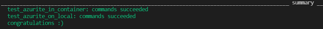

# Running Azurite in Tox Automation

## Overview

This repo presents a sample for automating tests required Azurite in Tox which mainly focuses running the service as a background process in a container and also on local. 

The code contains two simple Fast API calls, one for uploading data.txt into a blob storage and one for uploading the txt to local. And same scenario in the code is tested by reproduction with Azurite in `conftest.py`.

`tox.ini` file includes two environments, first environment is for running the tests in a Linux container which may be a case for isolation required scenarios. And the other environment is for te scenarios where local automation is satisfactory.

## Getting Started

[](https://github.com/Azure-Samples/azurite-tox-automation/actions/workflows/build.yml)

### Folder structure

Here's the folder structure for the sample:

- `container`
  - `Dockerfile` - Dockerfile which builds Linux container with all required components for running tests
  - `service_start.sh` - shell script being used for running Azurite in the container
- `data` - a data.txt sample to upload to/download from blob storage
- `src`
  - `__init__.py`
  - `app.py` - code file including FastAPI calls
  - `main.py`
  - `.env` - Environment variable files which includes Storage Account connection string to run FastAPI calls
- `tests`
  - `__init__.py`
  - `conftest.py` - Configuration file for running tests
  - `test_example.py` - Azure Blob Storage Test Code
  - `.test_env` - Environment variable connection details for Azurite - Azurite
- `requirements.txt` - Required pip packages to run the code and tests
- `tox.ini` - tox configuration file

### Prerequisites

The minimum requirement to see tests are running in the container and on your local is mainly:

- [Stable Python Version](https://www.python.org/downloads/).
- [Pip](https://packaging.python.org/guides/installing-using-pip-and-virtual-environments/)
- [Tox](https://tox.wiki/en/latest/install.html#installation-with-pip)
- [Docker](https://docs.docker.com/desktop/): to build container image and also run Azurite with docker compose on local

If you prefer to run FastAPI calls to see what code does which isn't the main focus of the sample though,
you need also a real blob storage in Azure Portal which means, following are prerequisites:

- [Azure Subscription](https://docs.microsoft.com/en-us/azure/cloud-adoption-framework/ready/azure-best-practices/initial-subscriptions)
- [Azure Resource Group](https://docs.microsoft.com/en-us/azure/azure-resource-manager/management/manage-resource-groups-portal)
- [Storage Account](https://docs.microsoft.com/en-us/azure/storage/common/storage-account-create?tabs=azure-portal) - the connection string of your account
should be added to .env file

For a better UI experience, it's recommended to use Storage Explorer to track the blob processes on your desktop;

- [Azure Storage Explorer](https://azure.microsoft.com/en-us/features/storage-explorer/).

### Install and Run Tox with Azurite

As it's mentioned in [Prerequisites](#prerequisites) section, we need to install Tox and then run the environments.

Running tox is platform agnostic. As soon as you have a Docker installed local environment to build a container, you can use Windows or Linux or Powershell/cmd or wsl/bash is used.

#### a. Installing Tox

Tox is an PyPI package which means as soon as you have Pip installation on your local, you can install it via

```bash
# Install Tox
pip install tox
```

#### b. Running Tox environments

In `tox.ini` file, you can see two environments in envlist section.

- test_azurite_in_container: virtual environment which builds [our Linux image](./continer/Dockerfile) with the repo code and Azurite service [script](./container/service_start.sh)
then run the tests in this container.

- test_azurite_on_local: virtual environment which runs all prerequisites for tests and run them on your local.

To run a specific environment in tox;

```bash
# Run test_azurite_in_container venv
tox -e test_azurite_in_container

# Run test_azurite_on_local venv
tox -e test_azurite_on_local
```

To run both environments at once;

```bash
# Run all env at once
tox
```

the output should be similar to:



### At glance

If you run test_azurite_in_container environment, you can see that it builds a container image on your local.

- The image is used to run the tests and build with [Dockerfile](./container/Dockerfile)

- On manual execution, Azurite kills the session and requires a new cmd session start. To run Azurite service at the background in the container,
[service_starts.sh](./container/service_starts.sh) which starts the service is copied into the container and being triggered from outside in tox environment execution.

- When tox completes test_azurite_in_container build, you will have a container image called 'pytest_linux' on your local. You can check it

```bash
# List docker images
docker images
```

- For manual checks, if you prefer to see the container content being run, you can run the image interactively

```bash
# Run image interactively
docker run -it pytest_linux bash
```

## License

See [LICENSE](LICENSE.md).

## Code of Conduct

See [CODE_OF_CONDUCT](CODE_OF_CONDUCT.md)

## Contributing

See [CONTRIBUTING](CONTRIBUTING.md)
Additionally kindly check [Issue Template](.github/ISSUE_TEMPLATE.md)  and [PR Template](.github/PULL_REQUEST_TEMPLATE.md)